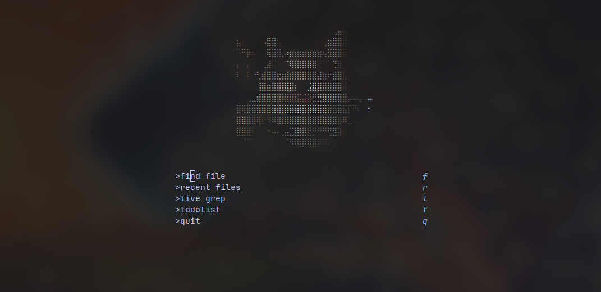

# Neovim

My config is built to work with Golang, TypeScript, Vue, React and Clojure, for the REPL in Clojure files I've been using Conjure.

## Alpha Neovim

To create ASCII images to Alpha, I'm currently using [ img2art ](https://github.com/Asthestarsfalll/img2art)

# Alacritty

Personal preference I guess.

# WM

Using i3 + i3status-rust + Rofi
